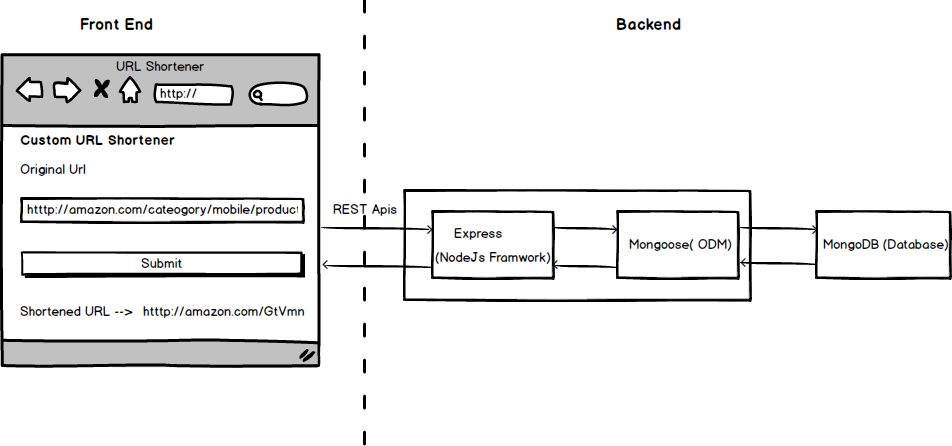

<h1 align="center">
  Lynqo
</h1>

<h4 align="center">A custom URL shortening service built with Node.js</h4>

<div align="center">
  <sub>Built with ❤︎ using Node.js, Express.js, MongoDB & React</sub>
</div>

<br>

Lynqo is a custom URL shortening platform that allows users to convert long URLs into short, easy-to-share links. It is built using **Node.js, Express.js, MongoDB, and React**, with Nginx used as a web server.

## Architecture



## Technologies

### Back End

* **[Express.js](https://expressjs.com/)** — Node.js framework for building REST APIs
* **[MongoDB](https://www.mongodb.com/)** — Document-oriented NoSQL database
* **[Mongoose](https://mongoosejs.com/)** — MongoDB object modeling tool
* **[Short-ID](https://github.com/dylang/shortid)** — Short ID generator
* **[Valid-URL](https://github.com/ogt/valid-url)** — URL validation functions
* **[Nginx](https://www.nginx.com/)** — High-performance web server

### Front End

* **[React](https://react.dev/)** — JavaScript library for building user interfaces
* **[React Router](https://reactrouter.com/)** — Routing library for React applications
* **[Materialize CSS](https://materializecss.com/)** — Responsive front-end framework based on Material Design

## Getting Started

### Clone the Project

```bash
git clone https://github.com/Aditi-018/lynqo.git
cd lynqo
```

### Run the Back End

```bash
cd server/
yarn install
yarn run server
```

### Run the Front End

Open a new terminal:

```bash
cd client/
yarn install
yarn run start
```

## Project Structure

```text
Lynqo/
├── client/          # React frontend
├── server/          # Node.js + Express backend
├── nginx/           # Nginx configuration
├── sketch/          # Architecture and project diagrams
├── .gitignore
└── README.md
```

## Features

* 🔗 Convert long URLs into short links
* ⚡ Fast URL redirection
* ✅ URL validation
* 🗄️ MongoDB-based data storage
* 🎨 React-based frontend
* 🚀 Express.js REST API
* 🌐 Nginx configuration for deployment

## Future Improvements

* [x] Frontend application
* [x] Documentation
* [x] Redis caching
* [ ] Improve short-code generation algorithm
* [ ] Add duplicate short-code prevention
* [ ] Add analytics for shortened URLs
* [ ] Add click tracking
* [ ] Add user authentication

## License

This project is licensed under the **MIT License**.
